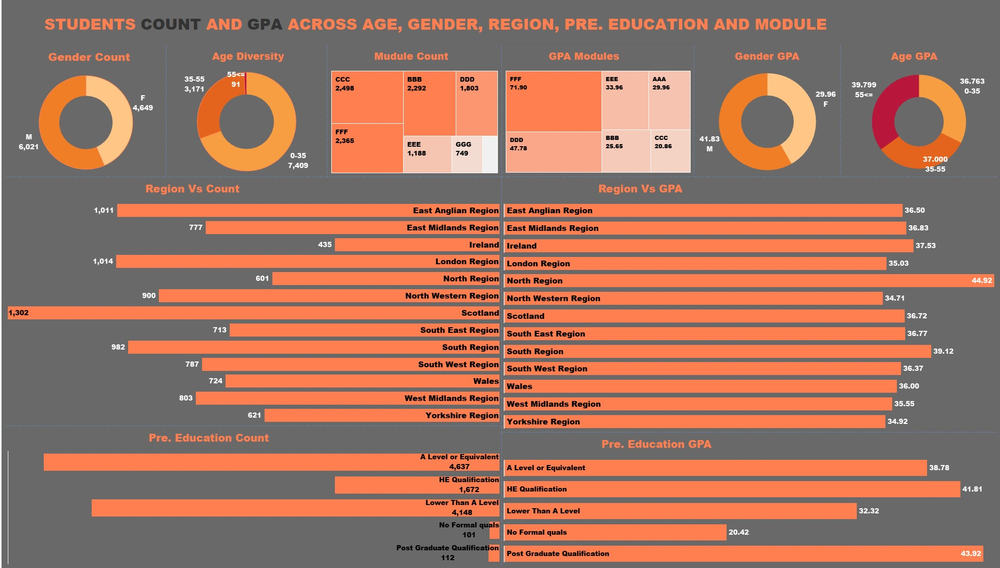
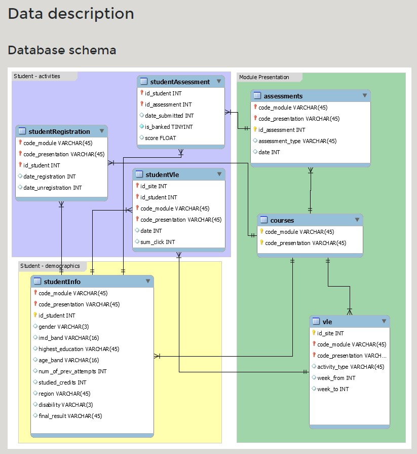

# EXCEL TABLEAU
# Analyzing/ Visualizing Student Grades in the Open University

## Introduction
#### Business Context
The Open University, one of the world's largest universities by enrollment, has been actively developing an analytics platform named OU Analyse to monitor student performance across its programs. The goal is to reduce dropout rates, increase student engagement, and enhance learning outcomes. As part of their efforts, they are expanding their analytics team and have tasked candidates with analyzing student grades.
### Business Problem
Candidates are provided with an anonymized dataset from the October 2014 cohort and are required to compute the Grade Point Average (GPA) for all students in that cohort. Additionally, they are to create a Tableau dashboard that includes GPAs and demographic data.
Dataset Overview
The dataset, contained in the OULA.xlsx file, includes demographic and assessment data for UK-based students from the October 2014 cohort. The Excel file consists of four worksheets:
1. student_info: Demographic information and module enrollment status.
2. modules: List of modules with coded names.
3. assessments: Details of assessments for each module.
4. student_assessment: Actual grades of students in each assessment.
## Data Preparation and Cleaning

### Data Preparation
The dataset required several preparation steps before computing GPAs and creating the Tableau dashboard:
1. Completed code_module Column: Utilized INDEX & MATCH functions to fill the code_module column in the student_assessment worksheet.
2. Filled weight Column: Populated the weight column in the student_assessment worksheet using data from the assessments worksheet.
3. Calculated Sum of Weights: Utilized a pivot table to compute the sum of weights for each code_module.
4. Completed weight_sum Column: Employed VLOOKUP with the sums of weights to complete the weight_sum column in the student_assessment worksheet.
5. Computed Product of Score and Weight: Calculated the product of score and weight for each assessment.
6. Calculated Weighted Scores: Divided (score x weight) by weight_sum for each student-assessment pair.
### Data Cleaning
Before proceeding with analysis and visualization, the dataset underwent cleaning processes such as:
1. Handling missing or incomplete data.
2. Ensuring consistency in data formats.
3. Removing duplicates or irrelevant information.
Creating the Dashboard
Dashboard Creation
## Utilized Tableau 
to create a dashboard allowing visualization of relationships between metrics (Average GPA, Student count) and dimensions (Age, Gender, Module, Region, Previous education). Implemented filters for multi-dimensional data analysis.
https://public.tableau.com/app/profile/mahmood.honarvar/viz/StudentGPA_17137040185070/Dashboard3?publish=yes
### Design Considerations:
* Clean and uncluttered dashboard layout.
* Charts employ "Use as filter" functionality.
* Appropriate chart types with clear titles and labeled axes.
### Deliverables
* Excel file containing exercise answers and Tableau dashboard link.
* Tableau Public dashboard link provided in the Q8 Dashboard Answer box of the ANSWER worksheet.
### Project Files
* OULA.xlsx: Dataset containing student and assessment information.
* README.md: Project overview and instructions.
* Student GPA.twb: Tableau workbook for the dashboard.

